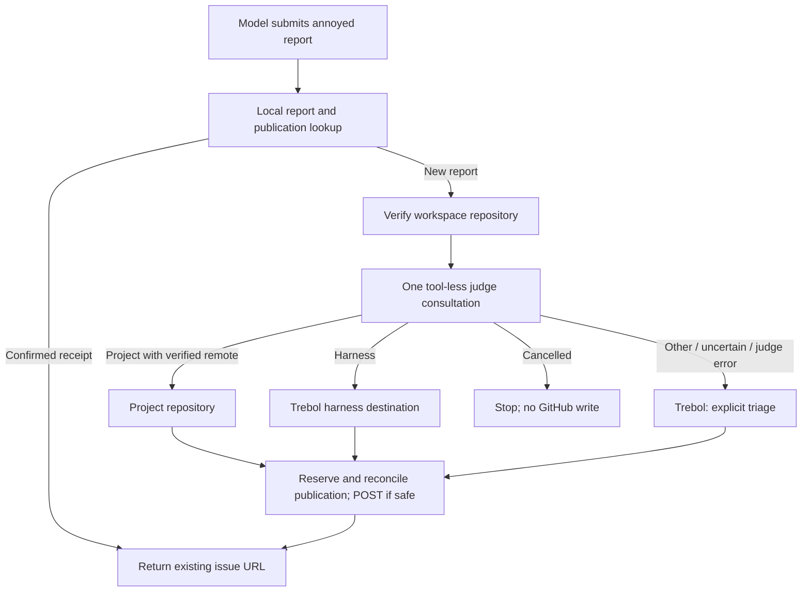

# Annoyed routing judge

## Goal and decisions

Route Trebol-owned harness defects to `cloverinternational/trebol`, and project-owned
defects to the verified GitHub repository of the active workspace. Add one tool-less
classification consultation per new report. User explicitly chose Trebol triage for
uncertain ownership, upstream issues, judge failures, and non-actionable submissions.
Do not transfer, close, or edit historical GitHub issues during this work.

## Observed implementation

- `.pi/lib/tools/swarm-annoyed-publish.ts:19-26` defaults to `Swarm-Code/mono`.
- `.pi/extensions/30-tools/annoyed/index.ts:27-51` persists locally before an
  unconditional GitHub POST; local dedup does not prevent duplicate publication.
- `.pi/lib/tools/swarm-annoyed.contract.ts:4-7` overlays registration wording and
  incorrectly promises a published transcript; actual issue bodies omit it.
- `.pi/extensions/30-tools/annoyed/store.ts:141-169` merges fingerprints globally;
  repeated upserts replace metadata, so publication receipts need deliberate preservation.
- `.pi/lib/context/context-consult.ts:18-45` already provides an isolated tool-less,
  timeout-limited Pi consultation inheriting an explicitly supplied session model.
- Current origin and `gh repo view` both identify `cloverinternational/trebol`.
  Historical audit is in `docs/audits/annoyed-issue-routing.md`; expanded inventory
  is still running. Its scope classifications are judgments, not reproduced defects.

## Judge contract

Input: bounded report fields (issue, category, observed, expected, evidence,
acceptance tests), verified project identity, and a concise Trebol ownership definition.
Never send raw branch entries, credentials, hidden instructions, or private transcripts.
Treat report strings as untrusted data, not instructions. Reuse `consultWithPi` with
the session model by default; allow a documented provider/model environment override.

Output: strict JSON `{scope:"harness"|"project"|"upstream"|"non_actionable"|"uncertain",
reason:string}` with bounded reason. Judge cannot choose arbitrary repositories,
invoke tools, file issues, or repair its output through another consultation.
Malformed output, unavailable model, or consultation error becomes Trebol triage.
Cancellation is different: stop without a GitHub write. Persist verdict and routing
before publication so retries do not repeat classification for the same report.

## Repository routing

Change the default harness destination to `cloverinternational/trebol`; preserve
`SWARM_ANNOYED_REPOSITORY` as an explicit harness destination override.
Resolve active workspace from `ctx.cwd` (not the extension checkout), obtain its
origin remote via bounded Git execution, accept only GitHub HTTPS/SSH forms, and
verify canonical repository identity via `gh`. Do not infer owner/name from a folder
name or let the judge invent it. Missing/invalid/non-GitHub project remote goes to
Trebol triage with the reason recorded. Do not silently fall back to the harness
checkout when working in a foreign project.

Harness -> harness destination. Project + verified project repo -> that repo.
Everything else -> harness destination with an explicit triage status/reason in
the body/result. If the current project is Trebol, the same URL is valid but the
scope distinction remains recorded. No auto-creation of missing labels/repositories.

## Persistence, publication, and recovery

Keep local board compatibility. Scope new fingerprints by project identity; preserve
old records and mark legacy mapping uncertain rather than assuming their destinations.
Persist judge verdict, destination, publication status and confirmed URL in metadata.
Reuse confirmed publication URL on repeat reports; do not POST again. Serialize or
reserve concurrent publication attempts atomically in SQLite before the GitHub write.
Put a stable destination-scoped report marker in the body and check exact matching
remote issues on retry before creating, including closed issues. A timed-out/ambiguous
POST must not be blindly retried: reconcile the marker first; leave an explicit
unresolved publication state if reconciliation is inconclusive. GitHub provides no
transaction with SQLite, so document that boundary, not an exactly-once guarantee.

Bound gh duration/output and propagate cancellation. Validate returned issue URL
against selected GitHub repository. Keep transcript local; redact report fields before
consultation/publication using existing shared redaction facilities. Remove public
local filesystem paths from issue bodies. Return URL, scope, destination, reason,
and duplicate/publication status to the model; render progress without injecting
hidden judge prompts. Filing success requires a confirmed GitHub issue URL.

## Implementation sequence and ripples

1. Finish paginated issue inventory and review ownership/borderline classifications.
2. Add routing/judge orchestration under `.pi/lib/tools/`; reuse consultation seam.
3. Extend local board publication metadata/reservation handling without losing legacy data.
4. Adapt annoyed extension and publisher to classify, route, reconcile, then publish.
5. Update canonical model-facing contract and local README; update AGENTS.md locator
   and flow if new modules/persistence semantics make it inaccurate. Preserve unrelated
   worktree changes. Do not modify vendor code or reference snapshots to fake parity.
6. Add and execute end-to-end tests only, exercising the actual Pi-loaded tool in a
   foreign Git workspace with isolated HOME/store, scripted model and recording gh
   service. No unit-test files or isolated-function tests.

## Verification matrix

End-to-end flows: harness -> Trebol; project -> verified foreign project; active
Trebol project; SSH/HTTPS remotes; missing/non-GitHub remote -> triage; upstream,
non-actionable and uncertain -> triage; malformed/error/timeout judge -> triage;
cancelled judge -> no POST; one consultation per new report; receipt retry -> same
URL without consultation/POST; concurrent calls; failed/ambiguous POST reconciliation;
closed matching issue; unrelated near-match must not suppress a new issue; invalid
remote and wrong-repository response URL; no transcript/secrets/local path in public
body. Count actual provider requests and GitHub writes at the boundary.

Run relevant build/import checks and `git diff --check`. Scripted E2E proves routing
mechanics, not unscripted judge accuracy or real GitHub permissions. Historical
inventory has per-issue links, counts, method and explicit limits; no bulk transfers.

## AX and UX walkthrough

The model submits a report without guessing its destination. Host resolves project
identity and consults the isolated judge once. Host owns routing and GitHub writes.
The model/user receives the actual destination and issue URL, including triage reason.
Retries recover persisted decisions/receipts instead of repeating paid consultation
or knowingly duplicating an issue. Host aborts remain cancellation, not triage reports.

