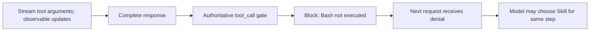
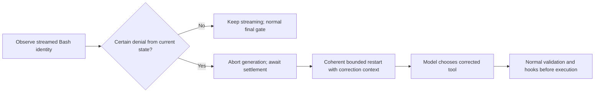

# Speculative tool calling research

## Design

Research only, 2026-10-06. Inputs: streamed name/argument fragments, policy state,
call identity and final arguments. Outputs considered separately: early detection,
execution prevention, next-request correction. Desired invariant: wrong Bash never
executes, model chooses correct tool for same logical step, no prerequisite/replay
requirement. State must distinguish suspected/confirmed denial, aborted generation,
settled transcript, and bounded correction attempts. No production implementation.

## Code-puppy

Pinned repository https://github.com/mpfaffenberger/code_puppy at
`a4c5518d632cd16cd03067a72cd2de38bd494be6`. Shallow clone
`/tmp/code-puppy-audit/repo`, clean after inspection. 713 tracked files; scoped
inspection of `_code_mode.py`, `_code_mode_guidance.py`, streaming/capability tests,
pyproject, README and SPECULATION_STATUS; not exhaustive. No submodule/LFS entries
reported by research worker; no full integrity audit performed.

- `code_puppy/agents/_code_mode.py:70-107`: list_files/read_file/grep default allowlist;
  registered tools may opt in with literal metadata speculatable=True.
- Same file 194-231: config opt-in, CodeMode wrapping, `eager=True`, read-write mount.
- `_code_mode_guidance.py:35-68`: execute literal read calls during generation;
  shell/writes never speculate, but eager statements may execute before generation
  ends. Approval must precede emission; later code cannot undo effects.
- `tests/agents/test_code_mode_streaming.py:71-109`: deterministic test source asserts
  a read starts while arguments are unfinished and gets claimed once. Not run here.
- `pyproject.toml:14-18`: harness 0.35.0 and pydantic-ai-slim 2.51.0 pinned;
  Monty is constrained <1, not exactly pinned there. Older module intro saying
  harness 0.33.0 is stale relative to dependency declaration.

Parent additionally downloaded the exact 0.35.0 PyPI wheel as inert source (not
installed/imported/executed), verified its PyPI SHA256
`ed1691d1045480bd9192b0dc13df5ae8a48448f2987cebb7344c11e3e319b293`, and inspected
`/tmp/code-puppy-audit/harness/pydantic_ai_harness/code_mode/_speculation.py`:

- 1-20, 465-506: accumulate run_code fragments keyed by part/call ID and scan partial
  code; launches use actual nested tool manager, so tool hooks run at launch.
- 353-363, 560-591: text scanner extracts complete literal calls (closing paren);
  scan cadence generally advances at newline boundaries. Even a call spelled in a
  string/comment or untaken branch can launch. Not arbitrary incomplete arguments.
- 635-666: actually launches asyncio task; not merely preparsing or warming a cache.
- 697-705: do not scan beyond tools not declared safe; 471-478 avoids streaming
  prelaunch when another tool part precedes this snippet.
- 751-798: claim by exact canonical function+arguments, FIFO multiplicity, own part
  preferred with cross-part fallback; adoption records result under actual nested ID.
- 817-881: completed snippets evict unused launches; failed snippets may retain for
  next-step reuse; cleanup cancels pending tasks and waits a bounded duration.
  Cancellation is not rollback and cancellation-swallowing tool tasks may outlive
  that wait. Purity is a declaration, not proved by the runtime.

These semantics optimize latency by doing read work early, not by redirecting the
currently generating model. No upstream runtime tests executed.

## Pi-contracts

Installed Pi 1.0.4 base path `/usr/lib/node_modules/@earendil-works/pi-coding-agent`.
References below are relative to this installation unless beginning `.pi/` or
`packages/` (repository). Inspected docs/extensions.md, SDK lifecycle excerpts,
pi-ai event documentation and actual implementation; not every provider audited.

- `dist/core/extensions/types.d.ts:693-700,809-813`: provider_stream_event (raw parsed
  adapter event) and message_update (normalized assistantMessageEvent).
- `node_modules/@earendil-works/pi-ai/README.md:703-724`: toolcall_start/delta/end,
  contentIndex, shared mutable partial state, interleaving. End is not schema validation.
- `node_modules/@earendil-works/pi-ai/dist/api/openai-completions.js:426-452`:
  accumulates string arguments and parses partial JSON before emitting delta.
- `node_modules/@earendil-works/pi-agent-core/dist/agent-loop.js:260-334`: forwards
  streamed tool deltas as message_update. 141-169: complete assistant response first,
  then tools. 143-153: aborted/error response ends loop without tool batch execution.
  481-516: validated call -> beforeToolCall -> block error, no executor entry.
- `dist/core/agent-session.js:905-912`: dispatches updates to extensions.
  `node_modules/@earendil-works/pi-agent-core/dist/agent.js:183-186`: steer queues for
  after assistant turn; loop 185-186 polls after tools. It does not modify active
  model generation. Session 1905-1915 aborts operation and awaits idle.
- `dist/core/extensions/runner.js:666-669`: ctx.abort delegates to abortFn; does not
  return a per-tool corrected continuation contract. Observer results are not
  tool_call block results. Streaming feedback is not automatically model context.
- `.pi/lib/runtime/swarm-builtin-hooks-runtime.ts:148-153`: actual pre-tool gate.
- `packages/context/autogenskills/src/index.ts:1090-1117`: Bash has no command-level
  exemption; focused-task/budget/review state determines skill denial. gateTool itself
  can mutate onboardingRecoveryArmed, so don't repeatedly call it per delta as a
  supposedly pure preview. `:1119-1139`: actual Skill invocation mutates usage/budget.
- `extensions/swarm-bash/extension.ts:40-65`, `.pi/lib/tools/swarm-bash.ts:23-38`:
  registered shell execution and model-facing command/cwd/env/timeout schema.

## Comparison

Code Puppy: launch complete literal inner read while outer code streams; adopt exact
matching result later. Eager tier can also execute non-speculative statements early.
Pi: observe partial tool arguments; execute only after complete assistant response.
Our desired early correction: detect certain denial, stop wrong generation, settle
consistent history and request replacement action. This is a different control flow.

## Safety

Earliest detection: once stable tool identity is known for argument-independent
skill-budget denial. If choosing Skill depends on command meaning or which skill
fits, a Bash name alone cannot decide. Partial command prefixes, quoting, escapes,
heredocs and later suffixes must not be treated as final semantics.

Reliable existing denial: tool_call gate. A stream observer can request whole-run
abort, but per-call cancellation + coherent automatic corrective continuation is
not a first-class inspected contract. For earlier intervention, need explicit
abort settlement, generation/call correlation, no execution race, transcript cleanup
and a bounded restart with model-visible correction. No guarantee of server billing
cessation or speedup was established. Some providers buffer arguments until late.

Keep final authoritative gate even if an early detector exists. Snapshot partial
values rather than retaining live mutable references; isolate interleaved call IDs.
State may change due to earlier sibling calls, so revalidate budget. Never make
speculative Skill invocation: it changes durable usage/budget and its instructions
cannot redirect an already-running model request by themselves. Read-only skill
lookup/prefetch is a separate optional optimization, not a successful invocation.
Repeated wrong choices need explicit bounded failure, not unbounded abort/restart.
Do not weaken permissions or launch rejected Bash while deciding.

## Visualization

Current Pi:

Candidate early correction (not implemented/verified):

No TUI status row causes either flow. UI observations and model-visible denial/context
are distinct; no live TUI inspection or active speculation status established.

## Conclusion

Early detection is available; earlier correction is plausible but conditional new
orchestration, not Code Puppy speculation copied wholesale. Prefer pure early policy
preview + existing authoritative denial first; explore bounded abort/restart only
with E2E proof of zero Bash execution, correct history, actual next-request context,
provider buffering and interleaved-call behavior. Never speculatively execute Bash
or Skill to implement correction. No code/runtime changes or new probes made here;
only this research report. Sources inspected, no benchmarks or upstream tests run.
